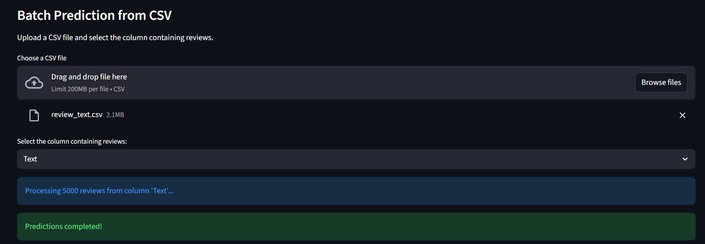

# 🍴 Amazon Fine Food Reviews Sentiment Analysis

## Overview

The **Amazon Fine Food Reviews Sentiment Analysis** project is designed to automatically evaluate customer feedback and determine whether reviews are **positive** or **negative**. By leveraging advanced **Natural Language Processing (NLP)** and **Machine Learning / Deep Learning techniques**, the system converts unstructured textual data into actionable insights.

**Purpose and Benefits:**
- Enables **businesses** to monitor customer satisfaction and identify sentiment trends in product reviews.
- Assists **data scientists and analysts** in applying real-world NLP and sentiment analysis techniques.
- Helps **consumers and researchers** understand public perception and product reputation.

**Global Relevance:**
Customer feedback plays a crucial role in decision-making across e-commerce platforms worldwide. This system is scalable, adaptable, and applicable to **any online marketplace**, enabling organizations to gain **data-driven insights** into customer sentiment at scale.


## App Interface

The Streamlit application provides an interactive and user-friendly interface for performing **sentiment analysis** on Amazon reviews. It supports both **single review prediction** and **batch prediction using CSV files**.

### Single Review Prediction

Users can type or paste a review into the input field. After clicking **Predict Sentiment**, the application displays:

- **Predicted Sentiment**: Positive or Negative
- **Confidence Score**: The model’s confidence in its prediction

**Example:**


*In this example, the review text is classified as **Positive** with a confidence score of 0.95.*

---

### Batch Prediction from CSV

Users can upload a CSV file containing multiple reviews. The app will:

1. Preprocess all reviews  
2. Predict the sentiment for each review  
3. Display the results in a table  
4. Provide an option to download the predictions as a CSV  

**Example:**  




*In this example, a CSV with 5000 reviews is uploaded. The app processes all reviews and provides their predicted sentiments.*


## Getting Started

Follow these steps to set up and run the Amazon Fine Food Reviews Sentiment Analysis app on your local machine.

#### 1. Clone the Repository

```bash
git clone https://github.com/shamilhussain21/amazon-fine-food-reviews-sentiment-analysis.git
cd amazon-fine-food-reviews-sentiment-analysis
```

#### 2. Create a Virtual Environment (Optional but Recommended)
- Windows:
```bash
python -m venv venv
venv\Scripts\activate
```
- Mac/Linux:
```bash
python -m venv venv
source venv/bin/activate
```
#### 3. Install Dependencies
```bash
pip install -r requirements.txt
```
#### 4. Run the Streamlit App
```bash
streamlit run app.py
```
- The application will launch in your default browser at http://localhost:8501.
- Users can perform both single review predictions and batch CSV-based predictions.


## Project Structure

```text
Amazon-Fine-Food-Reviews-Sentiment-Analysis/
│
├── app.py                         # Streamlit application
├── models/
│   ├── svm_amazon_model.pkl       # Trained SVM model
│   └── tfidf_vectorizer.pkl       # TF-IDF vectorizer
├── data/
│   ├── review_text.csv            # Sample input data for batch prediction
│   └── dataset_info.txt           # Dataset reference and download link
├── notebooks/
│   └── Amazon_Fine_Food_Reviews_Sentiment_Analysis_ML.ipynb
├── assets/
│   ├── interface_home.png         # App UI screenshot
│   ├── batch_review_prediction.png
│   └── batch_review_prediction_2.png
├── requirements.txt               # Project dependencies
└── README.md                      # Project documentation

```

## Tech Stack

This project leverages a combination of Machine Learning, Deep Learning, and web technologies:

### Programming Language
- **Python**

### Machine Learning & NLP
- **Scikit-learn** – SVM classifier, TF-IDF feature extraction
- **NLTK** – Text preprocessing (stopwords, lemmatization)
- **BeautifulSoup** – HTML text cleaning

### Deep Learning (Planned / In Progress)
- **Word2Vec** – Semantic word embeddings
- **BiLSTM** – Context-aware sequence modeling
- **Transformers (BERT / DistilBERT)** – State-of-the-art contextual embeddings

### Web Framework
- **Streamlit** – Interactive web application for predictions

### Data Handling & Visualization
- **Pandas**, **NumPy**
- **Matplotlib**, **Seaborn**

### Model Persistence
- **Joblib** – Saving and loading trained models

### Version Control & Deployment
- **Git & GitHub**


## Future Improvements

The following enhancements are planned to further improve the system:

- Implement **Word2Vec + BiLSTM** model for deeper contextual understanding
- Integrate **Transformer-based models (BERT, RoBERTa, DistilBERT)** for improved accuracy
- Add **real-time inference optimization** for faster predictions
- Extend support to **multi-class sentiment analysis** (e.g., Very Positive, Neutral, Very Negative)
- Deploy the application using **Docker** or **cloud platforms** (AWS / GCP / Azure)
- Add **model comparison dashboard** inside the Streamlit app
